# SusuFlow AI - Development Roadmap

**Project Start:** 2025-11-28  
**Hackathon Deadline:** 2025-12-08  
**Available Time:** 10 days  
**Status:** Phase 1 - Ready to Start

---

## 🎯 Project Vision

Build a mobile-first ROSCA (Rotating Savings and Credit Association) application on Celo that combines:
- **Smart Contract Automation** (Factory pattern with Self Protocol identity)
- **AI-Powered Management** (NoahAI agent for notifications and payouts)
- **MiniPay Integration** (PWA optimized for Opera Mini)

---

## 📊 Success Criteria (Hackathon Tracks)

| Track | Requirements | Status |
|-------|-------------|--------|
| **NoahAI** | AI agent automating pool management | 🔲 Not Started |
| **Self Protocol** | On-chain identity verification | 🔲 Not Started |
| **MiniPay** | Mobile-first PWA, Mainnet deployment | 🔲 Not Started |

**Scoring Focus:** User count + Transaction volume on Mainnet → Must deploy to Mainnet, not Testnet!

---

## 🗺️ Development Phases

### Phase 1: Smart Contract Foundation (Day 1-2)
**Goal:** Deploy verified, tested contracts to Alfajores testnet

#### Key Deliverables
1. **SusuFactory.sol**
   - Inherits from Self Protocol's `SelfVerificationRoot`
   - Manages pool creation with identity verification
   - Emits events for agent monitoring
   
2. **SusuPool.sol**
   - Handles savings cycle logic
   - Manages contributions in cUSD
   - Distributes payouts to cycle winners
   - Tracks member payment status

3. **Test Suite**
   - Full coverage of happy paths
   - Edge case testing (late payments, single member, etc.)
   - Gas optimization validation

#### Exit Criteria
- ✅ All tests passing
- ✅ Deployed to Alfajores
- ✅ Verified on Celoscan
- ✅ Manual test completed with testnet wallet

#### **👉 CHECKPOINT: Report Alfajores contract addresses before proceeding**

---

### Phase 2: NoahAI Agent (Day 3)
**Goal:** Create working AI agent that monitors and manages pools

#### Key Deliverables
1. **Event Listener**
   - Monitors blockchain for pool events
   - Tracks new pools, contributions, payouts
   
2. **Pool Monitor**
   - Identifies overdue payments
   - Detects pools ready for payout
   - Prioritizes actions by urgency

3. **Automation Logic**
   - Sends notifications (console logs for MVP)
   - Triggers `distributePot()` when conditions met
   - Handles failures gracefully

#### Technical Stack
- Node.js + TypeScript
- ethers.js for blockchain interaction
- Cron job or event-driven architecture

#### Exit Criteria
- ✅ Agent detects test events on Alfajores
- ✅ Automated payout trigger working
- ✅ Console shows intelligent decision-making

#### **👉 CHECKPOINT: Share agent console logs/video demo**

---

### Phase 3: Frontend MiniApp (Day 4-6)
**Goal:** Ship mobile-first PWA integrated with thirdweb and Self Protocol

#### Key Deliverables

##### Core Screens
1. **Landing + Connect** (`/`)
   - Explain SusuFlow value proposition
   - thirdweb ConnectWallet for MiniPay
   - Redirect flow based on verification status

2. **Identity Verification** (`/verify`)
   - Self Protocol widget integration
   - Visual feedback on verification status
   - Prevent unverified users from creating pools

3. **Dashboard** (`/dashboard`)
   - List of user's active pools
   - Quick stats: next payment, pot size, cycle progress
   - CTAs: Create new pool, view details

4. **Create Pool** (`/pools/create`)
   - Simple form: members count, amount, duration
   - Preview before submission
   - Transaction status handling

5. **Pool Details** (`/pools/[id]`)
   - Member list with payment status
   - Contribute button (cUSD transfer)
   - Payout history
   - Share/invite functionality

##### Technical Implementation
- **Framework:** Next.js 14 (App Router)
- **Styling:** Tailwind CSS (mobile-first)
- **Blockchain:** thirdweb SDK
- **Chain:** Celo Mainnet
- **PWA:** manifest.json + service worker

##### Design Principles
- Touch targets ≥ 48px
- High contrast for readability
- Clear loading states
- Optimistic UI updates
- Works offline (after initial load)

#### Exit Criteria
- ✅ All screens functional
- ✅ Responsive on 375px-768px screens
- ✅ Deployed to Vercel
- ✅ Tested in Opera Mini (or similar mobile browser)

#### **👉 CHECKPOINT: Share deployment URL + mobile screenshots**

---

### Phase 4: Mainnet Launch & Polish (Day 7-9)
**Goal:** Production deployment with demo-ready state

#### Critical Tasks
1. **Mainnet Deployment**
   - Deploy contracts to Celo Mainnet
   - Use Self Protocol Mainnet address: `0xe57F4773bd9c9d8b6Cd70431117d353298B9f5BF`
   - Verify on Celoscan
   - Fund with real CELO for gas

2. **Configuration Updates**
   - Update frontend env vars
   - Update agent config
   - Redeploy frontend to Vercel
   - Update agent to monitor Mainnet

3. **End-to-End Testing**
   - Create real pool on Mainnet
   - Make small cUSD contribution
   - Verify agent detects and acts
   - Complete one full payout cycle (if time permits)

4. **Demo Preparation**
   - Record 30-second mobile demo video
   - Screenshot all screens
   - Prepare 2-minute pitch (optional)
   - Write compelling README.md

5. **Final Quality Check**
   - Mobile performance optimization
   - Fix any UI bugs
   - Ensure error messages are user-friendly
   - Add helpful tooltips

#### Exit Criteria
- ✅ Contracts live on Mainnet
- ✅ Frontend works with Mainnet
- ✅ Agent running on Mainnet
- ✅ Demo video recorded
- ✅ All tracks validated

#### **👉 CHECKPOINT: Submit to hackathon portal!**

---

### Phase 5: Submission & Contingency (Day 10)
**Goal:** Submit on time with buffer for emergencies

#### Tasks
- Final README polish
- Submission form completion
- Team info and links
- Last-minute bug fixes
- Prayer to the demo gods 🙏

---

## 🛠️ Technical Architecture

```mermaid
graph TB
    User[👤 User in MiniPay] --> Frontend[🌐 Next.js PWA]
    Frontend --> ThirdWeb[🔗 thirdweb SDK]
    ThirdWeb --> Celo[⛓️ Celo Mainnet]
    
    Celo --> Factory[📋 SusuFactory]
    Factory --> Self[🔐 Self Protocol]
    Factory --> Pool1[💰 Pool A]
    Factory --> Pool2[💰 Pool B]
    
    Agent[🤖 NoahAI Agent] --> Listener[👂 Event Listener]
    Listener --> Celo
    Agent --> Trigger[⚡ Auto-Trigger Payouts]
    Trigger --> Celo
    
    style User fill:#e1f5ff
    style Agent fill:#fff4e1
    style Factory fill:#f0e1ff
    style Self fill:#e1ffe1
```



---

## 🚨 Critical Success Factors

### Must-Haves (Non-Negotiable)
1. ✅ **Mainnet Deployment** - Testnet won't score points!
2. ✅ **Self Protocol Integration** - Contract-level, not just frontend
3. ✅ **Working AI Agent** - Must show automation in demo
4. ✅ **Mobile Optimization** - Opera Mini compatibility
5. ✅ **Video Demo** - Shows full user journey

### Nice-to-Haves (Time Permitting)
- 🎨 Beautiful UI animations
- 📱 Deep links for pool invites
- 📊 Analytics dashboard for pool performance
- 💬 Actual Telegram notifications (vs console logs)
- 🔔 Email/SMS reminders via third-party API

### Avoid at All Costs
- ❌ Over-engineering (keep it simple!)
- ❌ Scope creep (stick to MVP)
- ❌ Testing only on testnet
- ❌ Skipping mobile testing
- ❌ Late submission due to perfectionism

---

## 📅 Daily Schedule (Suggested)

| Day | Focus Area | Deliverable |
|-----|-----------|-------------|
| **Day 1** | Setup + Factory Contract | `SusuFactory.sol` complete |
| **Day 2** | Pool Contract + Tests | Deployed to Alfajores |
| **Day 3** | NoahAI Agent | Agent running on testnet |
| **Day 4** | Frontend Setup + Auth | Landing + Verification screens |
| **Day 5** | Pool Creation + Dashboard | Core user flows working |
| **Day 6** | Pool Details + Polish | Vercel deployment live |
| **Day 7** | Mainnet Deployment | Contracts on Mainnet |
| **Day 8** | Integration + Testing | E2E working on Mainnet |
| **Day 9** | Demo + Documentation | Video recorded, README done |
| **Day 10** | Buffer + Submission | Submitted! 🎉 |

---

## 🎬 Demo Script (30 seconds)

**Use this for the demo video:**

1. **[0-5s]** 📱 Show Opera Mini with MiniPay wallet
   - "This is SusuFlow AI, a savings circle app for communities"

2. **[5-10s]** 🔐 Connect wallet + verify identity
   - Tap "Connect Wallet" → Self Protocol verification

3. **[10-15s]** ➕ Create new pool
   - Quick form: 5 members, $10/week, 5 weeks
   - Submit transaction

4. **[15-20s]** 💰 Show dashboard + make contribution
   - See active pool
   - Tap "Contribute $10" → Confirm in wallet

5. **[20-25s]** 🤖 Show agent console
   - Split screen: Agent logs detecting transaction
   - "NoahAI detected payment from User X"

6. **[25-30s]** ✨ Show payout
   - "Cycle complete! Payout sent to Winner"
   - End screen: "Built on Celo with Self & NoahAI"

---

## 🔗 Essential Resources

### Documentation
- [Self Protocol Docs](https://docs.self.xyz/) - Identity verification
- [Celo Docs](https://docs.celo.org/) - Blockchain basics
- [thirdweb Portal](https://portal.thirdweb.com/) - SDK integration
- [Foundry Book](https://book.getfoundry.sh/) - Contract development

### Tools
- [Celo Alfajores Faucet](https://faucet.celo.org/alfajores) - Testnet tokens
- [Celoscan](https://celoscan.io/) - Mainnet explorer
- [thirdweb Dashboard](https://thirdweb.com/dashboard) - Contract deployment UI
- [Vercel](https://vercel.com/) - Frontend hosting

### Community
- [Celo Discord](https://discord.gg/celo) - Dev support
- [Self Protocol Discord](https://docs.self.xyz/) - Integration help

---

## 📝 Decision Log

**Use this section to track important decisions:**

| Date | Decision | Reasoning |
|------|----------|-----------|
| 2025-11-28 | Using Foundry over Hardhat | Faster testing, better dev UX |
| 2025-11-28 | Next.js App Router (not Pages) | Modern, built-in optimizations |
| 2025-11-28 | thirdweb SDK for wallet | Best MiniPay compatibility |
| TBD | cUSD vs native CELO | TBD - Research gas costs |
| TBD | Cycle payout order | Random vs sequential? |

---

## ⚠️ Known Risks & Mitigations

| Risk | Probability | Impact | Mitigation |
|------|------------|--------|-----------|
| Self Protocol integration fails | Medium | High | Have backup: simple allowlist |
| Opera Mini doesn't support PWA | Low | High | Test early (Day 3-4) |
| Agent misses events | Medium | Medium | Use reliable RPC, add retry logic |
| Gas costs too high | Low | Medium | Optimize early, test on testnet |
| Vercel deployment issues | Low | Low | Have backup: Netlify |

---

## 🎯 Phase 1 - Ready to Start!

You are currently at **Phase 1: Smart Contract Foundation**.

### Next Steps:
1. Review [INSTRUCTIONS.md](file:///c:/Users/blexx/Desktop/Code/SusuFlow-AI/INSTRUCTIONS.md) for technical details
2. Review [DEV_PLAN.md](file:///c:/Users/blexx/Desktop/Code/SusuFlow-AI/DEV_PLAN.md) for task checklist
3. Start with contract setup:
   ```bash
   cd c:\Users\blexx\Desktop\Code\SusuFlow-AI
   mkdir contracts
   cd contracts
   forge init
   ```

### Focus Areas for Phase 1:
- 🎯 Get Foundry working
- 🎯 Implement `SusuFactory.sol` with Self Protocol
- 🎯 Implement `SusuPool.sol` with cUSD logic
- 🎯 Write comprehensive tests
- 🎯 Deploy to Alfajores

**Remember:** Speed is key, but don't skip testing. A working demo beats a perfect codebase!

---

**Let's build something amazing! 🚀**
